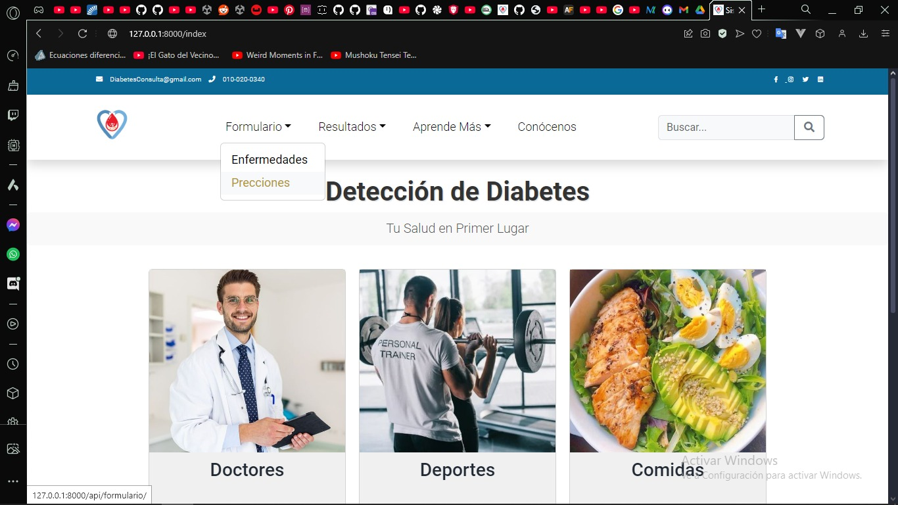
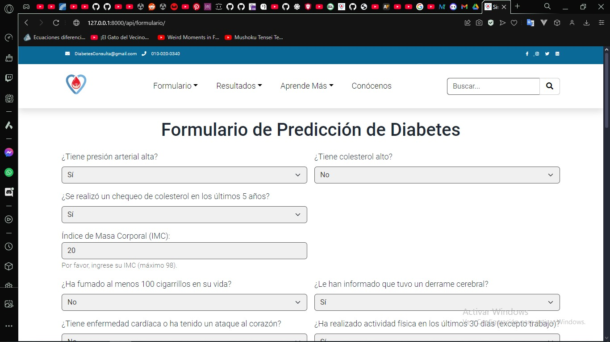
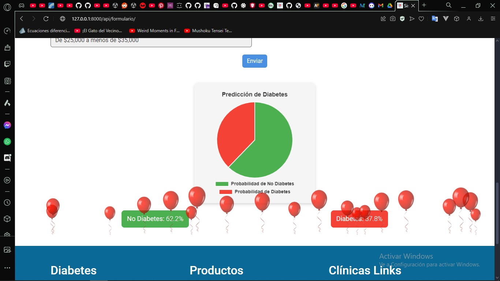

# Predicción de Diabetes con KNN

## Descripción

Este proyecto utiliza el algoritmo K-Nearest Neighbors (KNN) para predecir la diabetes a partir de datos ingresados a través de un formulario. El proyecto está desarrollado con el framework Django y se ha desplegado en Railway. Utiliza SQLite como base de datos.

## Autor

Gomez Abel

## Tecnologías Utilizadas

- **Django**: Framework web para desarrollar aplicaciones.
- **Scikit-learn**: Biblioteca de Python para Machine Learning.
- **Pandas**: Biblioteca para manipulación de datos.
- **NumPy**: Biblioteca para computación numérica.
- **SQLite**: Base de datos ligera.
- **Railway**: Plataforma para el despliegue de aplicaciones.

## Instalación

1. Clona este repositorio:
   ```bash
   git clone https://github.com/abel020/TP3_machineLearning.git
   ```

2. Navega al directorio del proyecto:
   ```bash
   cd TP3_machineLearning
   ```

3. Crea un entorno virtual e instálalo:
   ```bash
   python -m venv env
   source env/bin/activate  # En Windows usa `env\Scripts\activate`
   pip install -r requirements.txt
   ```

4. Inicia el servidor:
   ```bash
   python manage.py runserver
   ```

## Uso

1. Abre tu navegador y ve a `http://127.0.0.1:8000`.
2. Completa el formulario con los datos necesarios.
3. Envía el formulario para obtener la predicción de diabetes.

## Capturas de Pantalla

### Menú Principal


### Formulario de Entrada


### Predicción de Diabetes


## Despliegue

Este proyecto está desplegado en Railway. Puedes acceder a la aplicación en el siguiente enlace:

[Enlace a la aplicación desplegada](https://tp3machinelearning-production.up.railway.app)

### Archivos importantes para el despliegue

- **Procfile**: Este archivo es necesario para que Railway sepa cómo ejecutar la aplicación.
- **runtime.txt**: Este archivo especifica la versión de Python que se utilizará en el entorno de Railway.

## Contribuciones

Si deseas contribuir a este proyecto, por favor sigue estos pasos:

1. Realiza un fork del repositorio.
2. Crea una nueva rama (`git checkout -b feature/nueva-caracteristica`).
3. Realiza tus cambios y haz un commit (`git commit -m 'Añadir nueva característica'`).
4. Haz push a la rama (`git push origin feature/nueva-caracteristica`).
5. Abre un Pull Request.


